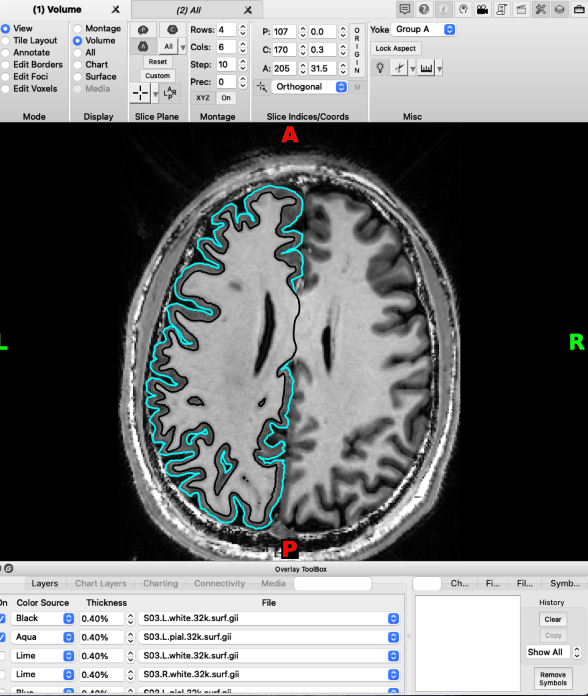

# Software requirements
- [Freesurfer](https://surfer.nmr.mgh.harvard.edu/fswiki/DownloadAndInstall)
- [Connectome Workbench](https://www.humanconnectome.org/software/connectome-workbench)
- [SurfAnalysis Toolbox for Matlab](https://github.com/Diedrichsenlab/surfAnalysis)
- [SurfAnalysis Toolbox for Python](https://github.com/DiedrichsenLab/surfAnalysisPy)

# Standard Surface Spaces

### fsaverage
The fsaverage surface is the standard surface space for Freesurfer. It is defined on a sphere with 163842 vertices. The surface is not symmetric across the left and right hemisphere. That is, a vertex with a specific number will refer to different areas in each hemisphere.
There are downsampled version fsaverage6 and fsaverage5 with 40962 and 10242 vertices, respectively (CHECK).

### fs_LR
For our studies, it is often useful to have a surface that is defined in a symmetric way across the left and right hemisphere. In the connectome workbench a emerging standard here is the fs_LR surface. A vertex with a specific number will refer to roughly homologous areas in both hemispheres. The fs_LR comes in three sample resolutions: 32k, 59k, and 164k. For standard functional imaging analysis with a functional voxel size of >1.4mm, the 32k surface has high enough resolution to give at least one vertex per gray matter voxel.

# Our basic individual surface pipeline

## Step 1: Individual surface reconstruction
Individual surface reconstruction is performed by freesurfer software, using recon-all. What is needed is a 3D T1-weighted image (ideally 1mm resolution or better) of the subject's anatomy.
```
recon-all -s <subj_name> -i <T1image.nii> -all -cw256
```
This process take several hours (or more) per subject, and produces freesurfer files in the directory <SUBJECT_DIR>/<subj_name>. As part of the process, freesurfer also does a spherical alignment of each individual hemisphere to the fsaverage template.

**N.B.:** The BIDS app, fMRIPrep, automatically runs Freesurfer's ``` recon-all ``` as part of its standard workflow, unless the Freesurfer option is explicitly turned off.


## Step2: Transforming to fs_LR space
The next step is to resample the individual surface from fsaverage space (e.g., the Freesurfer output created in Step 1) into fs_LR space. You can do this by calling the Matlab toolbox function:
```
surf_resliceFS2WB(subj_name,fsDir,wbDir,'resolution','32k')
```
As inputs, the function requires the location of the Freesurfer ```<SUBJECTS_DIR>``` (```fsDir```), the location of the directory to which the resampled, Workbench format files will be written (```wbDir```), and the subject ID (```subj_name```). The function will create a subfolder for the subject in wbDir and save all gifti files there. By default, the function resamples the white, pial, and inflated surface.  It also creates files for the sulcal depth, curvature, and area.  Unless ```resolution``` is specified in the function call, the default resampling will be to the ~32k surface.

**N.B.:** For additional information on the default Freesurfer directory setup and how to change the location of Freesurfer's ```<SUBJECTS_DIR>```, please see following the Freesurfer wiki [page]().

## Step3: Checking the individual surface reconstruction

To check that surfaces were reconstructed correctly and match the T1, pull up workbench:

```
wb_view
```

#### Check via 3d-surface
Open the native space T1 (for example sub-01_T1w.nii) and the pial surfaces for the left and right hemisphere (sub-01_space-32k_hemi-L_white.surf.gii & sub-01_space-32k_hemi-R_pial.surf.gii ). In the montage tab, click on ```All``` (is set to ```Montage``` by default). You might have to also click ```On``` for the T1 image in the overlay toolbox to show the T1.


You should now see the T1 image and reconstructed pial surface. Rotate the image to see whether the surface is aligned with the sulci in the T1. An extreme mismatch would look like this:


A subtler mismatch of the right hemisphere could look like this:


And here is a perfect match between pial surface and T1 image:


Remove the pial surface and add the white matter surface reconstruction. Make sure you removed the pial surface from you viewer, otherwise you won't see the white matter surface under the pial surface. Follow the same process as for the pial surface check, click on ```All``` and rotate the image to see how T1 and the white matter surface align. Mismatches for the white matter surface should be easy to spot since the white matter surface at the cortex should neatly fit into the grey matter on the T1 like below.


Focus on the white matter surface going into the coronal T1 slice, not the saggital slice. Since the white matter connects the hemispheres only at the corpus callosum, which is hidden behind the rest of the white matter in this view, it's hard to spot mismatches to the saggital T1 slice. Instead, look at where the white matter surface enters the coronal slice and the axial slice.

#### Check via outline  
An alternative way to check the individual surface is to load the volume and the two surfaces at the same time in `wb_view` and select Volume view. 
On the Overlay toolbox, select the Vol/Surf outline tab. This gives you the option to add the two surfaces as outlines in different colors. This allows for a accurate check of the alignment of the surfaces with the volume. Make sure you scroll through the entire volume to check for alignment issues across the entire neocortex.  



## Step 4: Mapping data from volume to surface
After the subject's anatomical images have been resampled into fs_LR space, the next step is to map any volumetric functional files (e.g., statistical parametric maps) to surface space via the individual surface.  

#### Matlab
In matlab this step is implemented in calling `surf_vol2surf` in the [SurfAnalysis Toolbox](https://github.com/Diedrichsenlab/surfAnalysis):
```
surf_vol2surf(c1,c2,V,'anatomicalStruct','CortexLeft')
```
As inputs, the function requires a Px3 matrix of vertices (x,y,z coordinates) for the individual's white surface (```c1```), a Px3 matrix of vertices (x,y,z coordinates) for the individual's pial surface (```c2```), and a list of volumes (loadable with spm_vol) to be mapped (```V```). These files were generate in step 2. Unless ```anatomicalStruct``` is specified in the function call, the default surface is ```CortexLeft```; other options are ```Cerebellum``` and ```CortexRight```.

#### Python 
In python you can achieve functional to surface mapping using the [SurfAnalysisPy Toolbox](https://github.com/DiedrichsenLab/surfAnalysisPy)

```
import surfAnalysisPy as surf
Data = surf.map.vol_to_surf(volumes, whiteSurfGifti, pialSurfGifti,
            stats='nanmean') 
```

For an example see [here](https://github.com/DiedrichsenLab/surfAnalysisPy/blob/master/notebooks/flatmap_example.ipynb)

#### Workbench 
For alternative functionality see wb_command volumne-to-surface-mapping
https://www.humanconnectome.org/software/workbench-command/-volume-to-surface-mapping


## Step 5: Summarizing individual data in group files

#### Matlab
Finally, to make a group gifti file containing the surface data from multiple subjects, the following Matlab toolbox function can be called:
```
surf_groupGiftis(P,'groupsummary','groupSummaryFile')
```
As input, the function takes a cell array of N ```func.gii``` files (one file per subject) with P experimental conditions, such as those created during Step 3.  If no cell array is specified, the function will prompt the user to select the ```func.gii``` files using ```spm_select()```.  The function creates P group ```func.gii``` files (one group file per experimental condition) with N columns (one column per each subject).  If ```groupsummary``` is specified in the function call, the function will also produce a single group summary file of the mean across all subjects, with one column for each experimental condition.

