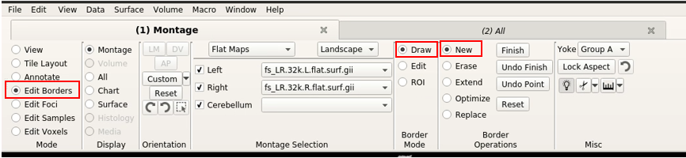
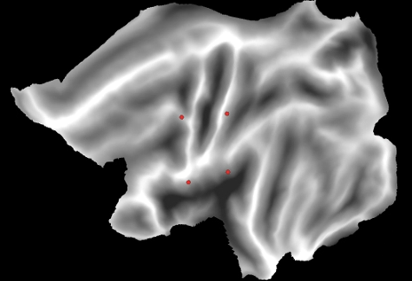

# 1. Open connectome workbench interface
To open the connectome workbench interface:
1. open a new terminal
2. type wb_view
3. press enter

# 2. Load a surface file and a layer
To load a surface file:
1. Click File > Open File...
2. Nevigate to the directory where the templates are stored (for example: /cifs/diedrichsen/data/Atlas_templates/fs_LR_32)
3. Choose a surface file, and click open (for example: fs_LR_32k.L.flat.surf.gii)
4. Use the save method to load a layer file (: for example: fs_LR_32k.LR.sulcus.dscalar.nii )

# 3. Draw a new ROI
In the top bar:
1. Within the "Mode" section, choose "Edit Borders"
2. Within "Border Mode" section, choose "Draw"
3. Within "Border Operation" section, choose "New" 



4. With a pen toll, define the border of the new ROI



# 4. Save the border file
To save the new border file:
1. In the top bar, within the "Border Operation section", click "Finish"
2. Name the new border file (for example: newROIs.border), and add a name to the specific ROI you just created (for example: myROI.border)
3. Save the border file by clicking "File > Save/Manage Files…", and then checking the new border file in the Manage Data Files window.


# 5. Convert the border file to a ROI
To make a ROI from the boarder file:
1. Open a new terminal
2. Use the '<-border-to-rois>' command to convert the border file to a ROI.

```
wb_command -border-to-rois <surface> <border-file> <metric-out>
```

'<surface>' is the full path to the surface the borders are drawn on; '<border-file>' is the  full path to the border file you want to convert; '<metric-out>' is the full path to the output ROI file. 

Usage example:

```
wb_command -border-to-rois 
'/cifs/diedrichsen/data/Atlas_templates/fs_LR_32/fs_LR.32k.L.flat.surf.gii' 
'/cifs/diedrichsen/data/Atlas_templates /articulation.border' 
'/cifs/diedrichsen/data/Atlas_templates /articulation.shape.gii'
```