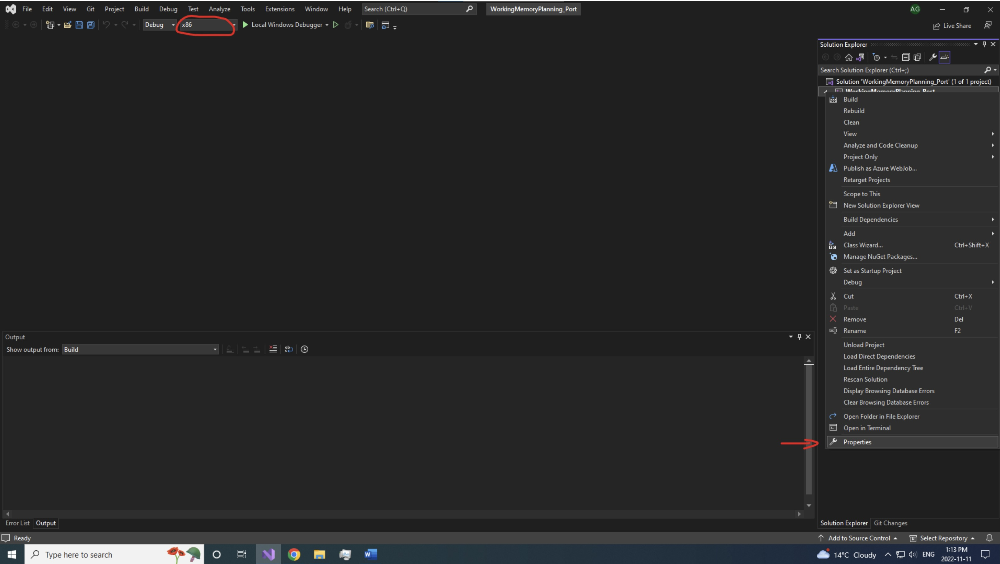
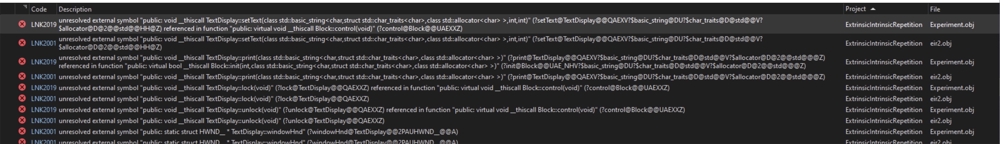

<style>
  .hero-header {
    background: linear-gradient(135deg, #667eea 0%, #764ba2 100%);
    color: white;
    padding: 3rem 2rem;
    border-radius: 12px;
    margin-bottom: 3rem;
    box-shadow: 0 10px 30px rgba(102, 126, 234, 0.3);
  }

  .hero-header p {
    margin: 0.5rem 0;
    font-size: 1.1rem;
    opacity: 0.95;
  }

  .step-badge {
    display: inline-block;
    background: linear-gradient(135deg, #667eea 0%, #764ba2 100%);
    color: white;
    width: 40px;
    height: 40px;
    border-radius: 50%;
    text-align: center;
    line-height: 40px;
    font-weight: bold;
    font-size: 1.2rem;
    margin-right: 1rem;
    margin-bottom: 1rem;
    box-shadow: 0 4px 15px rgba(102, 126, 234, 0.4);
    transition: all 0.3s ease;
  }

  .step-badge:hover {
    transform: translateY(-3px);
    box-shadow: 0 7px 20px rgba(102, 126, 234, 0.6);
  }

  .step-title {
    display: flex;
    align-items: center;
    margin: 2.5rem 0 1.5rem 0;
    padding-bottom: 1rem;
    border-bottom: 2px solid #f0f0f0;
  }

  .step-title h3 {
    margin: 0;
    font-size: 1.5rem;
    color: #2c3e50;
  }

  .divider {
    height: 3px;
    background: linear-gradient(90deg, transparent, #667eea, transparent);
    margin: 2.5rem 0;
    border-radius: 2px;
  }

  .callout {
    padding: 1.5rem;
    border-left: 5px solid;
    border-radius: 8px;
    margin: 1.5rem 0;
    background-color: #f8f9fa;
    transition: all 0.3s ease;
  }

  .callout:hover {
    transform: translateX(5px);
    box-shadow: 0 4px 12px rgba(0, 0, 0, 0.1);
  }

  .callout-warning {
    border-left-color: #f39c12;
    background-color: #fff8e1;
  }

  .callout-warning strong {
    color: #d68910;
  }

  .callout-note {
    border-left-color: #3498db;
    background-color: #ebf5fb;
  }

  .callout-note strong {
    color: #2874a6;
  }

  .config-list {
    list-style: none;
    padding: 0;
    margin: 1.5rem 0;
  }

  .config-list li {
    padding: 1rem;
    margin: 0.75rem 0;
    background-color: #f8f9fa;
    border-left: 4px solid #667eea;
    border-radius: 6px;
    transition: all 0.3s ease;
  }

  .config-list li:hover {
    background-color: #f0f2f5;
    border-left-color: #764ba2;
    transform: translateX(5px);
  }

  .config-list strong {
    color: #2c3e50;
  }

  .config-list code {
    background-color: #ecf0f1;
    padding: 0.2rem 0.5rem;
    border-radius: 4px;
    font-family: 'Courier New', monospace;
    color: #c0392b;
  }

  .image-container {
    margin: 2rem 0;
    text-align: center;
  }

  .image-container img {
    max-width: 100%;
    height: auto;
    border-radius: 8px;
    box-shadow: 0 8px 25px rgba(0, 0, 0, 0.15);
    transition: all 0.3s ease;
  }

  .image-container img:hover {
    transform: translateY(-5px);
    box-shadow: 0 12px 35px rgba(0, 0, 0, 0.25);
  }

  .image-caption {
    font-size: 0.9rem;
    color: #7f8c8d;
    margin-top: 0.5rem;
    font-style: italic;
  }

  .code-block {
    background-color: #2c3e50;
    border-radius: 8px;
    margin: 1.5rem 0;
    overflow: hidden;
    box-shadow: 0 4px 12px rgba(0, 0, 0, 0.1);
  }

  .code-block code {
    color: #ecf0f1;
    font-family: 'Courier New', monospace;
  }

  .contact-card {
    background: linear-gradient(135deg, #667eea 0%, #764ba2 100%);
    color: white;
    padding: 2rem;
    border-radius: 12px;
    margin: 2rem 0;
    box-shadow: 0 10px 30px rgba(102, 126, 234, 0.3);
    text-align: center;
  }

  .contact-card a {
    color: #ffd700;
    text-decoration: none;
    font-weight: bold;
  }

  .contact-card a:hover {
    text-decoration: underline;
  }

  @media (max-width: 768px) {
    .hero-header {
      padding: 2rem 1.5rem;
    }

    .step-title {
      flex-direction: column;
      align-items: flex-start;
    }

    .step-badge {
      margin-bottom: 1rem;
    }

    .config-list li {
      padding: 0.75rem;
    }
  }
</style>

<div class="hero-header">
  <p><strong>Ali Ghavampour</strong> – drafted in 2022</p>
  <p>📧 alighavam79@gmail.com</p>
</div>

## Overview

**Example:** Porting a project from old XP system to Windows 10

The old codes were written in 32-bit format on MS Visual C++ 6 on Windows XP PCs. We want to port the old codes to work on MS Visual C++ 2022 Community on a 64-bit Windows 10 PC in this example.

<div class="divider"></div>

<div class="step-title">
  <span class="step-badge">1</span>
  <h3>Creating an empty project</h3>
</div>

Create a new empty project in MS VC++ 2022.

<div class="image-container">
  
  <p class="image-caption">Create a new project in Visual Studio 2022</p>
</div>

The location of the project must be: `C:\robotcode\projects\`

<div class="divider"></div>

<div class="step-title">
  <span class="step-badge">2</span>
  <h3>Project configurations</h3>
</div>

<div class="callout callout-warning">
  <strong>⚠️ Important Step:</strong> Change solution from x64 to x86 (top tool bar) first!
</div>

Then open project properties and change the following configurations:

<ul class="config-list">
  <li>
    <strong>Character Set Configuration</strong><br>
    Project → Properties → Configuration Properties → Advanced → Character set<br>
    Set to <code>"Use multi-byte character set"</code>
  </li>
  <li>
    <strong>Include Directories</strong><br>
    Project → Properties → Configuration Properties → VC++ Directories → Include Directories<br>
    Add the include (header files) to the include directories: <code>C:\robotcode\include</code>
  </li>
  <li>
    <strong>Source Directories</strong><br>
    Project → Properties → Configuration Properties → VC++ Directories → Source Directories<br>
    Add the source to the source directories: <code>C:\robotcode\source</code>
  </li>
  <li>
    <strong>Subsystem Configuration</strong><br>
    Project → Properties → Configuration Properties → Linker → System → SubSystem<br>
    Change to <code>"Windows(/SUBSYSTEM:WINDOWS)"</code> (this is a Windows application, not a console application)
  </li>
</ul>

<div class="image-container">
  
  <p class="image-caption">Change solution platform from x64 to x86 in the toolbar</p>
</div>

<div class="divider"></div>

<div class="step-title">
  <span class="step-badge">3</span>
  <h3>Adding the project source and header files</h3>
</div>

Create your project's main source (`.cpp`) and header (`.h`) files. Choose a template project you want to make your code based on. Open the main source (`.cpp`) and header (`.h`) files of the template project and copy & paste the codes to your files.

<div class="divider"></div>

<div class="step-title">
  <span class="step-badge">4</span>
  <h3>Ignoring MS VC++ warnings</h3>
</div>

The original library and codes use `sprintf()` and `sscanf()` functions. However, these functions are forced to be replaced with `sprintf_s()` and `sscanf_s()` by the MS VC++ compiler. To ignore this error:

Project → Properties → Configuration Properties → C/C++ → Preprocessor → Preprocessor definitions

Add `_CRT_SECURE_NO_WARNINGS` and click OK.

<div class="divider"></div>

<div class="step-title">
  <span class="step-badge">5</span>
  <h3>Add the project dependencies</h3>
</div>

By right-clicking on your project name in the "solution explorer" and selecting "Add → Existing item", add all the project dependencies from `C:\robotcode\include` and `C:\robotcode\source` to your project.

<div class="callout callout-warning">
  <strong>⚠️ Critical:</strong> If you don't add any of the project dependencies, you will face errors saying <code>"unresolved external symbol"</code>. Here is an example:
</div>

<div class="image-container">
  
  <p class="image-caption">Example of unresolved external symbol error</p>
</div>

<div class="divider"></div>

<div class="step-title">
  <span class="step-badge">6</span>
  <h3>Create a data folder</h3>
</div>

Create a temp data folder for your experiment in `C:\data\<your project name>\`

<div class="callout callout-note">
  <strong>📝 Note:</strong> The code does not create this folder automatically. Your experiment might not run without it.
</div>

<div class="divider"></div>

<div class="step-title">
  <span class="step-badge">7</span>
  <h3>Change the paths in your main file</h3>
</div>

There are some paths in the main source codes of projects that might need change, especially if you are using a new PC. Some of the paths to check in your main code are:

**If you are using sounds for your task:**

```cpp
string TASKSOUNDS = {
  "C:/robotcode/util/wav/ding.wav",           // 0
  "C:/robotcode/util/wav/smb_coin.wav",       // 1
  "C:/robotcode/util/wav/chimes.wav",         // 2
  "C:/robotcode/util/wav/smb_kick.wav",       // 3
  "C:/robotcode/util/wav/bump.wav",           // 4
  "C:/robotcode/util/wav/chord.wav",          // 5
  "C:/robotcode/util/wav/smb_pipe.wav",       // 6
  "C:/robotcode/util/wav/error.wav"           // 7
};
```

**In the WinMain (your main program):**

```cpp
gExp = new MyExperiment("eir2", "eir2", "C:/data/ExtrinsicIntrinsicRepetition/eir2/");

// initialize s626cards
s626.init("c:/robotcode/calib/s626_single.txt");
```

<div class="divider"></div>

<div class="step-title">
  <span class="step-badge">8</span>
  <h3>Change the experiment setting if needed</h3>
</div>

**In the WinMain (your main program):**

```cpp
gScreen.init(gThisInst, 1920, 0, 1920, 1080, &(::updateGraphics));
```

The first two numbers are the relative position of the second monitor in pixels and the second two are the resolution in pixels.

<div class="divider"></div>

<div class="step-title">
  <span class="step-badge">9</span>
  <h3>Don't forget the target files</h3>
</div>

Add the experiment target folder (including `.tgt` files) to the main folder of your project where your main `.cpp` and `.h` files are (e.g. `C:\robotcode\projects\ExtFlxChord\ExtFlxChord`).

<div class="divider"></div>

## Extra Notes

Your code should compile and build if you do all the steps carefully! If it still doesn't work, you might be using some source and include files or a template project that were not ported by Ali Ghavampour because he didn't need them for his projects. You might need to fix them.

<div class="contact-card">
  <p>Questions or issues? Reach out!</p>
  <p>📧 <a href="mailto:alighavam79@gmail.com">alighavam79@gmail.com</a></p>
</div>
